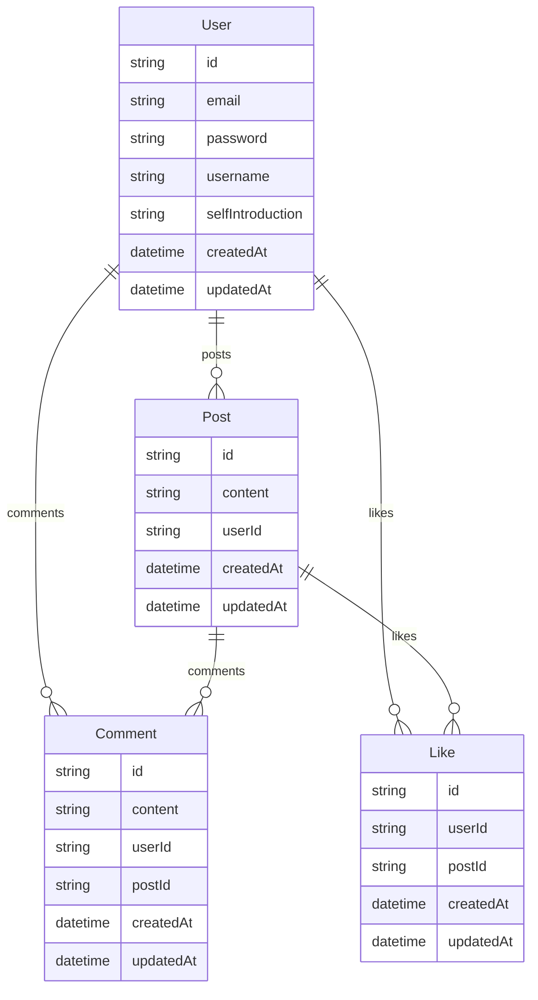

```mermaid
erDiagram
  User ||--o{ Post : posts
  User ||--o{ Comment : comments
  User ||--o{ Like : likes
  Post ||--o{ Comment : comments
  Post ||--o{ Like : likes
  User {
    string id
    string email
    string password
    string username
    string selfIntroduction
    datetime createdAt
    datetime updatedAt
  }
  Post {
    string id
    string content
    string userId
    datetime createdAt
    datetime updatedAt
  }
  Comment {
    string id
    string content
    string userId
    string postId
    datetime createdAt
    datetime updatedAt
  }
  Like {
    string id
    string userId
    string postId
    datetime createdAt
    datetime updatedAt
  }
```